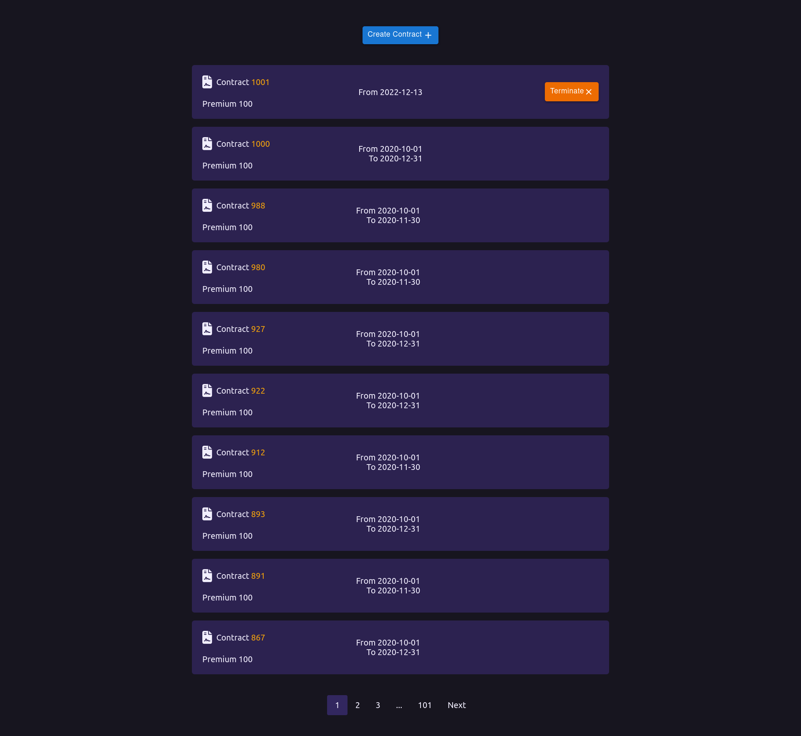

# Admin Tool

Figurative insurance system that processes events in the backend and generates an administration tool in the frontend.

## Project Specifications

- Parse contract events on the back-end
- Fetch a list of all contracts from the backend, based on existing events
- Render contracts on the front-end with pagination
- Handle requests to create and terminate contracts

## Routes

`GET /api` returns a list of all contracts, based on existing events  
`POST /api/create` saves new **ContractCreatedEvent** event  
`POST /api/terminate` saves new **ContractTerminatedEvent** event  

## Notes

Due to the large number of contracts, I added client-side pagination to facilitate navigation. No more than 10 contracts will be rendered per page. I also implemented rate limiting on the front-end, so the user is only allowed to create one contract every 2 seconds.

## Coded with

- React & Material UI
- Node
- Express

Live Site URL: https://admin-tool.onrender.com/

